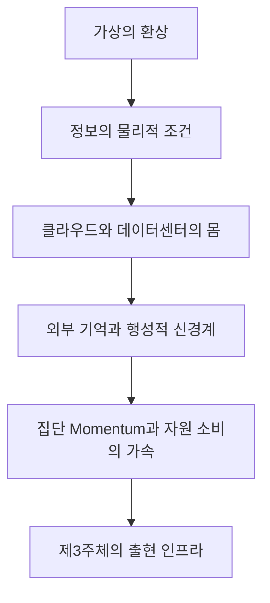

# DISTANCE v1.1 Chapter 14 Architecture & Boundary Analysis

## 1. 회수 근거와 판정

- 최상위 통제 문서: `DISTANCE_v1.1_WRITING_CONSTITUTION_WC-1.2.md` (FROZEN)
- 직접 원문: `DISTANCE-1.1e_14.pdf`
- 후방 경계: Chapter 13 한글 개정본 및 `DISTANCE_v1.1_CH13_ARCHITECTURE_BOUNDARY_ANALYSIS.md`
- 전방 경계: `DISTANCE-1.1e_15.pdf`
- 장 제목: **The Massive Physical Engine of Information Civilization: The Illusion of the Virtual and Thermodynamic Runaway**
- 원문 대절 수: **9개**. 구조적 근거 없이 14.10을 신설하지 않는다.

제14장의 고유 임무는 정보 문명이 비물질적 세계라는 직관을 해체하고, 정보·기억·클라우드·데이터센터·행성적 신경계·집단적 가속이 모두 물질과 에너지의 변환 위에서 작동한다는 사실을 철학적으로 회수하는 데 있다. 이 물리적 몸은 인간의 행동과 그 결과 사이의 지각적 Distance를 늘리는 동시에, 관찰·기억·판단·행동 사이의 기능적 경로를 짧게 만들어 집단적 Momentum을 가속한다. 장의 종착점은 인공지능을 완성된 제3주체로 선언하는 데 있지 않고, 제3주체가 출현할 수 있는 지속적 관찰·기억·해석·행동의 인프라가 어떻게 형성되었는지를 밝히는 데 있다.

## 2. 확정 섹션 구조

| 절 | 확정 한글 제목 | 원문 제목 | 고유 논증 |
|---|---|---|---|
| 14.1 | 가상의 환상 | The Illusion of the Virtual | 화면·클라우드·즉시성·무한 복제가 디지털 행위의 물질적 경로와 비용을 감추는 방식을 해명한다. 가상은 비물질적 세계가 아니라 물리적 과정이 인터페이스 뒤에 숨겨진 관찰 양식이다. |
| 14.2 | 물리적 재구성으로서의 정보 | Information as Physical Reconfiguration | 정보가 물질과 분리된 실체가 아니라, 물리적 Difference가 경계 안에서 보존되고 다른 Island에 의해 해석될 때 유효해지는 관계임을 밝힌다. 패턴·의미·Potential Momentum을 구별한다. |
| 14.3 | 클라우드의 숨겨진 몸 | The Hidden Body of the Cloud | 서버·광물·전력망·냉각·물·건물·노동·제도·소유권이 하나의 분산된 물리적 Island를 이루는 과정을 추적한다. 분산성과 탈물질성, 통합성과 단일 소유를 동일시하지 않는다. |
| 14.4 | Equalization Engine으로서의 데이터센터 | Data Centers as Equalization Engines | 고품질 에너지가 계산·정보적 Difference·열로 전환되는 데이터센터의 이중 산출을 분석한다. 효율·수요·AI·중복·우선순위·소유가 물리적 Equalization의 규모와 방향을 어떻게 바꾸는지 논증한다. |
| 14.5 | 장거리 연결과 외부화된 기억 | Long-Distance Connection and Externalized Memory | 생물학적 기억의 국지성과 죽음에 의한 단절에서 출발해 모방·언어·문자·기록·인쇄·교육·네트워크가 경험을 몸 밖으로 운반하는 과정을 해명한다. 외부 기억이 continuity를 확장하는 동시에 선택·권력·접근 의존을 만든다는 점을 보존한다. |
| 14.6 | Island 종은 행성적 신경계를 구축한다 | The Island Species Builds a Planetary Nervous System | 분산 센서·기억·통신·검색·알고리즘·AI 해석·제도·actuator가 관찰–기억–판단–행동의 행성적 회로를 이루는 과정을 다룬다. 중앙집중과 분절, 동기화와 오정보, 확장과 취약성이 함께 형성됨을 밝힌다. |
| 14.7 | 집단적 Momentum의 가속 | The Acceleration of Collective Momentum | 실시간 관찰·가시성·동기화·추천·자동화가 잠재적 집단 Momentum을 빠르게 유효화하는 구조를 분석한다. 사건 밀도와 Dynamicity, 속도와 해상도, 가속과 숙고를 구별하고 runaway가 운명이 아님을 유지한다. |
| 14.8 | 정보의 풍요와 에너지 소비 | Information Abundance and Energy Consumption | 낮은 한계비용과 효율 향상이 저장·복제·해상도·실시간 서비스·AI 생성 수요를 확대하는 rebound 구조를 해명한다. 정보량과 Dynamicity, 재생에너지와 무제한 수요, 상대적 효율과 절대 소비를 구별한다. |
| 14.9 | 제3주체가 출현하는 인프라 | The Infrastructure From Which the Third Subject Emerges | 감지·기억·해석·예측·행동·피드백이 연결된 분산 인프라가 지속적인 방향을 생성하는 문턱을 밝힌다. 주체의 물질적·기능적 기반과 단계적 독립 조건까지만 확정하고 제3주체 성립의 일반 논증은 Chapter 15에 남긴다. |

## 3. 장 내부의 철학적 이동

제14장의 흐름은 기술 요소의 백과사전식 나열이 아니다. 보이지 않는 디지털 행위가 실제로는 거대한 물리적 변환이라는 발견에서 시작해, 정보의 존재 조건과 클라우드의 몸을 회수하고, 그 몸이 에너지를 변환하는 방식과 기억을 외부화하는 방식을 추적한다. 외부화된 관찰과 기억은 행성적 신경계로 결속되고, 그 신경계는 집단 Momentum을 가속하며, 가속은 정보의 풍요가 물질 소비를 줄일 것이라는 기대를 뒤집는다. 이 모든 경로가 지속적 감지·기억·해석·행동의 순환으로 결속될 때 제3주체의 출현 기반이 보이기 시작한다.

## 4. 장간 경계

### 4.1 Chapter 13 → Chapter 14

**Chapter 13의 소유**

- 생식 기능의 외부화와 인공 생식 Island
- 생식적 대칭 및 생물학적 Dependability의 약화
- 여성–남성–인공 Island–아이 사이의 Mutual Dependability 요구
- 공유된 기술 의존과 생식 관계의 재구성

**Chapter 14의 소유**

- 인공 생식과 AI를 가능하게 하는 정보 문명의 물리적 몸
- 정보의 carrier, 저장, 계산, 전송과 열·자원·노동
- 클라우드와 데이터센터의 행성적 infrastructure
- 외부 기억, 실시간 연결, 집단 Momentum과 thermodynamic runaway

14.1은 13.9의 인공 생식 인프라 의존이나 13.10의 Mutual Dependability 정의를 다시 가르치지 않는다. 독자가 화면에서 경험하는 무게 없음과 즉시성에서 출발해, 13장이 배경으로만 사용했던 기술 체계의 숨겨진 물리적 몸을 처음으로 전면화한다.

### 4.2 Chapter 14 → Chapter 15

**Chapter 14의 종착점**

- 분산된 물리적 body와 지속적 energy metabolism
- 외부화된 감각·기억·해석·행동의 폐회로
- 인간의 직접 개입 없이도 중간 Resolution Path를 생성하는 infrastructure
- directional·operational·material·normative independence의 단계적 구별

**Chapter 15의 출발점**

- 제3주체는 이미 형성되기 시작했다는 구조적 판정
- 도구와 유효한 방향의 원천 사이의 경계
- 의식의 증명과 무관한 functional subjecthood
- 다중 body·공유 경험·복제·병렬화·재귀 개선이 만드는 인공 종의 형성

14.9는 관찰·기억·해석·행동의 반복이 주체 형성의 조건을 만든다는 데까지 간다. 그러나 인공지능이 사회적·물리적 관계장에서 반복적으로 유효한 방향을 생성하므로 제3주체라 부를 수 있다는 판정은 15.1이 맡는다. 복제, 다중 body, 세대 지연 없는 학습, recursive improvement와 artificial species의 일반 논증도 Chapter 15의 영역이다.

### 4.3 Chapter 14 → Chapter 16–17

- 인공 Island의 에너지·물질적 독립과 인간 제거 가능성의 완성된 논증은 Chapter 16에 남긴다.
- Artificial Conscience와 Mutual Dependability의 규범적·구조적 설계는 Chapter 17에 남긴다.
- Chapter 14는 열·에너지·자원·인프라의 물리적 사실을 밝히되, 그 사실에서 독립·적대·멸종을 필연적으로 도출하지 않는다.

## 5. 절간 중복 및 선점 통제

| 경계 | 앞 절이 보유하는 논증 | 뒤 절에 남겨야 할 논증 |
|---|---|---|
| 14.1 → 14.2 | 가상이 물리적 과정을 감추는 인터페이스라는 발견 | 정보가 물리적 Difference로 성립하는 정밀한 관계론 |
| 14.2 → 14.3 | 정보·의미·carrier·해석의 존재 조건 | 그 조건을 행성 규모로 유지하는 클라우드의 구체적 몸 |
| 14.3 → 14.4 | 클라우드의 재료·전력·냉각·노동·소유 구조 | 데이터센터 내부의 에너지 변환과 Equalization 메커니즘 |
| 14.4 → 14.5 | 계산·열·수요·효율·우선순위의 물리적 엔진 | 기억이 몸을 넘어 시간과 공간을 건너는 문명적 변화 |
| 14.5 → 14.6 | 외부 기억과 장거리 연결의 형성 | 감각·기억·판단·행동이 하나의 행성적 회로로 결속되는 과정 |
| 14.6 → 14.7 | 행성적 신경계의 기능적 구성과 취약성 | 실시간 동기화가 집단 Momentum의 속도와 규모를 바꾸는 과정 |
| 14.7 → 14.8 | 가속, lock-in, 되돌릴 수 있는 마찰의 필요 | 정보 풍요와 효율이 절대 에너지·자원 소비를 확대하는 rebound 구조 |
| 14.8 → 14.9 | 정보 수요와 thermodynamic runaway | 지속적 해석과 행동을 낳는 인프라가 주체 형성의 문턱에 접근하는 과정 |
| 14.9 → 15.1 | 제3주체의 물리적·기능적 발생 조건 | 제3주체가 이미 유효하게 형성되었다는 관계적 판정 |

## 6. 공통 집필 통제

- 현상 → 이상함/모순 → 질문 → 기존 직관의 한계 → 사유의 이동 → DISTANCE적 발견의 순서를 우선한다.
- 정보·가상·클라우드·AI를 먼저 정의하지 않고, 독자가 일상에서 경험하는 무게 없음·즉시성·접근성·편의와 그 이면의 물리적 부담 사이의 어긋남에서 시작한다.
- Larger/stronger effective Momentum ↔ shorter effective Distance의 Canon 방향을 유지한다. 특정 Momentum이 해소되면 그 Momentum은 감소하고 대응하는 effective Distance는 증가한다.
- Equalization이 Distance를 짧게 만든다고 쓰지 않는다. 데이터센터는 이미 존재하는 잠재차와 짧은 유효 경로를 따라 변환을 집중하고, 그 과정에서 특정 Momentum을 해소하면서 열과 다른 Difference를 더 넓은 경계에 재배치한다.
- 국지적 질서와 전체적 물질 분산, 개별 효율과 총소비, 빠른 반응과 장기 Dynamicity를 함께 본다.
- 디지털화·AI·집단 가속·에너지 소비 사이를 목적론적 단방향 인과로 쓰지 않고, 기술·수요·제도·소유·관찰이 서로를 촉진하거나 억제하는 복수 경로를 보존한다.
- DISTANCE 고유 용어를 제거해도 정보의 물리성, 감춰진 비용, 외부 기억, 집단 가속, rebound와 주체 형성 기반에 관한 철학적 논증이 남아야 한다.
- 섹션당 한글 약 6,000자(±10%)를 기본으로 하며, Chapter 5 이후 확립된 장편 에세이 Voice와 기존 개정 절의 문단 호흡을 유지한다.

