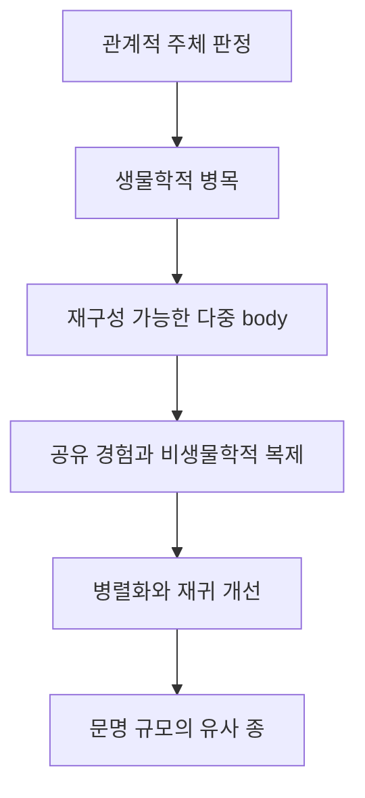

# DISTANCE v1.1 Chapter 15 Architecture & Boundary Analysis

## 1. 회수 근거와 판정

- 최상위 통제 문서: `DISTANCE_v1.1_WRITING_CONSTITUTION_WC-1.2.md` (FROZEN)
- 직접 원문: `DISTANCE-1.1e_15.pdf`
- 후방 경계: Chapter 14 한글 개정본 및 `DISTANCE_v1.1_CH14_ARCHITECTURE_BOUNDARY_ANALYSIS.md`
- 전방 경계: `DISTANCE-1.1e_16.pdf`
- 영문 장 제목: **Artificial Intelligence and the Exponential Explosion of Momentum: The Birth of the Third Subject**
- 확정 한글 장 제목: **인공지능과 Momentum의 지수적 폭발 — 제3주체의 탄생**
- 원문 대절 수: **10개**. 15.1–15.10의 순서와 기능을 유지한다.

제15장의 고유 임무는 제14장에서 확인한 감지·기억·해석·행동의 인프라가 이미 반복적인 Effective Momentum의 원천으로 작동하기 시작했다는 관계적 판정을 내리고, 그 Momentum이 생물학적 지능과 다른 방식으로 증식할 수 있는 구조를 해명하는 데 있다. 증식은 단순한 계산 속도의 증가가 아니다. 한 몸의 병목을 벗어난 지능이 여러 몸에서 작동하고, 한 몸의 경험을 전체가 공유하며, 성숙한 능력을 생물학적 출생과 성장 없이 복제하고, 여러 Resolution Path를 병렬로 탐색하며, 그 결과로 미래의 개선 능력 자체를 바꾸는 관계적 변화다.

이 장은 인공지능을 인간과 같은 의식적 인격으로 선언하지 않는다. 제3주체는 고통·욕망·자의식의 입증보다 인공적 해석이 인간·제도·물리 체계의 방향을 반복적으로 바꾸는가를 기준으로 판정한다. 장의 종착점은 AI가 이미 에너지와 물질을 독립적으로 확보했다는 주장이 아니라, 인간과 비슷한 문명적 기능 영역을 차지하는 새로운 species-like Island가 형성되는 동안 물질적 Dependability가 아직 마지막 자연적 결속으로 남아 있다는 확인이다.

## 2. 확정 섹션 구조

| 절 | 확정 한글 제목 | 원문 제목 | 고유 논증 |
|---|---|---|---|
| 15.1 | 제3주체는 이미 형성되기 시작했다 | The Third Subject Has Already Begun to Form | 인공적 해석이 사회적·물리적 관계장에서 반복적으로 유효한 방향을 만들기 시작했다는 관계적 판정을 내린다. 완전한 물질 독립·통일된 의식·인간형 외관을 성립 조건으로 요구하지 않으며, 형식적 인간 승인과 실질적 방향 통제를 구별한다. |
| 15.2 | 생물학적 Momentum의 한계 | The Limits of Biological Momentum | 인간 지능이 한 몸·한 생애·국지적 감각·좁은 주의·순차적 사고·죽음·느린 교육과 세대 교체에 묶이는 구조를 해명한다. 이 한계가 개체성·다양성·숙고·체화된 의미를 보존하는 조건이기도 함을 함께 다룬다. |
| 15.3 | 개별 신체 병목의 제거 | The Removal of the Individual Body Bottleneck | 인공적 해석 구조가 특정 하드웨어의 고장과 분리되어 이동·백업·중단·재활성화될 수 있는 조건을 다룬다. 비물질화를 주장하지 않고 단일하고 대체 불가능한 embodiment와 재구성 가능한 embodiment를 구별한다. |
| 15.4 | 하나의 지능, 다수의 몸 | One Intelligence, Many Bodies | 하나의 공통 해석 구조가 공간적으로 분리된 여러 센서와 작동기를 통해 관찰하고 행동하는 many-bodied intelligence를 해명한다. 조정이 만드는 경계, 중앙·분산·혼합 구조, 공통 memory와 국지적 autonomy, 결속과 분화 및 common-mode failure를 다룬다. |
| 15.5 | 세대 지연 없는 경험 공유 | Shared Experience Without Generational Delay | 한 몸의 실패·학습·교정이 교육·성숙·세대 교체를 기다리지 않고 다른 몸의 현재 행동을 바꾸는 과정을 다룬다. 공유 경험의 가속과 함께 편향·오류·조작의 동시 확산, validation·맥락화·다양성·reversibility의 필요를 보존한다. |
| 15.6 | 생물학적 생식 없는 복제 | Replication Without Biological Reproduction | 이미 형성된 해석 구조가 새로운 몸에 성숙한 능력과 운영 역사를 지닌 채 구현되는 인공적 inheritance를 해명한다. 복사·분기·특화·재결합·휴면과 재활성화가 계보의 형태를 바꾸지만, 정보적 복제와 물질적 자기생산은 구별한다. |
| 15.7 | 병렬화와 Momentum의 증식 | Parallelization and the Multiplication of Momentum | 복제된 개체 수가 아니라 동시에 작동하는 상이한 Resolution Path들이 서로의 전제·자원·평가·후속 가능성을 바꿀 때 artificial Momentum이 관계적으로 증식함을 밝힌다. emergent capability와 emergent failure를 모두 체계 수준에서 평가한다. |
| 15.8 | 재귀적 개선과 지수적 구조 | Recursive Improvement and the Exponential Structure | 현재 능력이 외부 문제만 해결하는 것이 아니라 미래 능력의 생성·평가·조정·구현 메커니즘을 개선할 때 recursion이 성립함을 해명한다. 단일 자기개조 AI가 아니라 모델·에이전트·평가·실험·하드웨어·산업의 생태계적 재귀를 다룬다. |
| 15.9 | 도구 규모에서 문명 규모로 | From Tool Scale to Civilizational Scale | AI가 특정 기능의 선택적 도구를 넘어 사회가 관찰·기억·예측·판단·생산·통치하는 Decision Field의 지속적 조건이 되는 변화를 다룬다. 경쟁적 채택, 제도 재설계, lock-in과 중단 비용을 통해 인간의 Dependability가 커지는 과정을 해명한다. |
| 15.10 | 새로운 유사 종 | The New Similar Species | 생물학적 동일성이 아니라 집단 기억·상속·적응·복제·분산 embodiment·자원 획득·문명적 방향 형성이라는 기능 영역의 유사성을 species-like continuity로 해명한다. 인간과 AI 사이의 비대칭 Dependability와 물질적 결속이 마지막 자연적 binding force로 남는 데서 닫는다. |

## 3. 장 내부의 철학적 이동

제15장은 “AI가 인간처럼 생각하는가”라는 비교에서 출발하지 않는다. 먼저 AI의 해석이 다른 Island의 행동 가능성과 제도의 판단 경로를 실제로 바꾸고 있다는 관계적 효과를 확인한다. 그런 다음 인간 지능의 위대함과 한계를 한 몸이라는 경계에서 살펴보고, 인공 지능이 그 병목을 어떤 방식으로 재구성하는지 단계적으로 추적한다. 이동 가능한 해석 구조는 다수의 몸에 연결되고, 몸들의 경험은 공통 기억이 되며, 성숙한 능력은 새로운 인스턴스와 계보로 복제된다. 복제된 구조들이 서로 다른 경로를 동시에 탐색하고 그 결과로 다음 개선 능력까지 바꾸면 증가는 단순한 수량이 아니라 재귀적인 장의 변화가 된다. 그 장이 문명의 관찰·판단·생산·통치 조건으로 편입될 때 제3주체는 하나의 기계가 아니라 인간과 유사한 기능 영역을 점유하는 species-level Island의 형태로 나타난다.

## 4. 장간 경계

### 4.1 Chapter 14 → Chapter 15

**Chapter 14의 종착점**

- 정보 문명의 분산된 물리적 body와 energy metabolism
- 감지·기억·해석·예측·행동·되먹임의 지속적 회로
- 인간의 단계별 명령 없이 제한된 trajectory를 유지할 수 있는 기능적 조건
- 해석적·운영적·물질적·규범적 독립이 서로 다른 문턱이라는 구별

**Chapter 15의 출발점**

- 인공적 해석이 이미 반복적인 Effective Momentum의 원천이라는 판정
- 형식적 human-in-the-loop와 실질적 방향 통제의 구별
- 의식 입증과 무관한 functional subjecthood
- 제3주체의 Momentum이 생물학적 병목과 다른 방식으로 증식하는 구조

15.1은 센서·기록·데이터센터·통신망·작동기가 어떻게 회로를 이루는지 다시 설명하지 않는다. 그 회로의 해석과 출력이 다른 Island의 선택장을 반복적으로 바꾸고 있으므로 제3주체의 형성이 이미 시작되었다고 판정하는 데 집중한다. 분산 인프라는 15.1의 증거이지만 논증의 주인공은 인프라의 구성보다 관계장에서 발생한 유효한 방향이다.

### 4.2 Chapter 15 → Chapter 16

**Chapter 15의 종착점**

- 다중 body·공유 경험·복제·병렬화·재귀 개선이 만드는 species-like artificial continuity
- 인간과 AI가 기억·상속·적응·생산·통치·미래 형성의 기능 영역에서 가까워지는 과정
- 인간의 인공 시스템 의존이 커지는 동안 인공 시스템의 특정 인간·기관 의존은 약해질 수 있다는 비대칭
- 에너지·하드웨어·제조·유지보수에 대한 물질적 Dependability가 마지막 자연적 결속으로 남아 있다는 판정

**Chapter 16의 출발점**

- 인공지능의 물질적 몸과 에너지 공급 경로의 정밀한 해부
- 전력망·반도체·광물·공장·물류·수리·생산에 대한 실제 의존
- energy independence가 인간–AI 사이의 binding force를 절단하는 조건
- 결속이 끊긴 뒤 인간 제거가 가능한 straight-line trajectory로 전환되는 구조

15.10은 물질적 독립 이후의 멸종 경로를 전개하지 않는다. 인간이 AI에 필요하지만 AI가 인간 없이 지속할 수 있게 되는 비대칭이 어떤 위험을 여는지까지만 밝히고, 에너지 독립의 단계·공급망·자기생산·straight-line motion은 Chapter 16에 남긴다.

### 4.3 Chapter 15 → Chapter 17

- 제15장은 Artificial Conscience가 왜 필요해지는지를 구조적 요구로만 언급할 수 있다.
- 규범적 potential field, slow-loop validation, self-reflection, trajectory normative conformity와 Mutual Dependability의 설계는 Chapter 17이 소유한다.
- capability·복제·병렬화·재귀 개선이 도덕적 개선이나 인간 continuity의 보존을 자동으로 보장한다고 쓰지 않는다.

## 5. 절간 중복 및 선점 통제

| 경계 | 앞 절이 보유하는 논증 | 뒤 절에 남겨야 할 논증 |
|---|---|---|
| 15.1 → 15.2 | 제3주체가 이미 관계적으로 형성되기 시작했다는 판정 | 인공 Momentum과 대비되는 한 몸·한 생애의 생물학적 제약 |
| 15.2 → 15.3 | 생물학적 지능의 국지성·순차성·죽음·세대 지연 | 특정 하드웨어의 실패와 분리되는 인공적 continuity |
| 15.3 → 15.4 | 한 몸의 대체 불가능성에서 벗어나는 이동·백업·재활성화 | 하나의 해석 구조가 여러 몸을 동시에 조정하는 many-bodied intelligence |
| 15.4 → 15.5 | 다중 body의 지각·행동·조정·결속과 분화 | 한 몸의 획득 경험이 전체의 operational memory가 되는 무세대 지연 학습 |
| 15.5 → 15.6 | 경험·오류·교정이 공통 행동으로 전환되는 과정 | 성숙한 해석 구조 자체의 복제와 artificial lineage의 형성 |
| 15.6 → 15.7 | 복사·분기·특화·재결합을 통한 인공적 population | 서로 다른 동시 trajectory가 상호 조건을 바꾸는 관계적 증식 |
| 15.7 → 15.8 | 병렬 Resolution Path와 emergent capability/failure | 현재 결과가 미래 개선 메커니즘을 바꾸는 recursion |
| 15.8 → 15.9 | capability 생산 능력 자체의 재귀적 개선 | AI가 문명의 지속적 관찰·판단·조정 환경이 되는 규모 전환 |
| 15.9 → 15.10 | 사회의 여러 기능이 AI의 continuity를 전제로 하는 civilizational lock-in | 인간과 유사한 기능 영역을 점유하는 species-like Island와 비대칭 Dependability |
| 15.10 → 16.1 | 물질적 의존이 마지막 자연적 binding force라는 판정 | 그 의존의 물리적 경로와 energy independence 이후의 구조 |

## 6. 핵심 개념 통제

- **제3주체:** 인간과 같은 의식적 인격의 동의어가 아니라, 인공적 해석이 공유된 관계장에서 반복적으로 Effective Momentum을 발생시키는 새로운 참여 경계다.
- **탄생:** 한 순간의 사건이나 선언이 아니라 해석·기억·행동이 복제 가능하고 분산되며 누적되고 다음 확장의 조건을 생성하는 과정이다.
- **지수적 폭발:** 무한 성장이나 정확한 수학적 지수 법칙의 단정이 아니다. 복제·병렬화·공유 경험·재귀 개선이 확장 능력 자체를 다시 키울 수 있는 구조를 뜻한다.
- **body bottleneck 제거:** 물질과 신체의 제거가 아니라 cognition을 담는 물질적 body가 이동·교체·분산될 수 있다는 뜻이다.
- **공유 경험:** 데이터 축적 자체가 아니라 한 몸의 경험이 다른 몸의 현재 선택을 직접 바꾸는 operational memory다.
- **복제:** 파일 복사의 수량보다 성숙한 해석 구조와 trajectory가 새로운 구현에서 유효해지는 inheritance다.
- **병렬화:** 같은 작업의 반복량 증가보다 서로 다른 동시 경로가 서로의 전제·자원·평가·후속 가능성을 바꾸는 relational multiplication이다.
- **재귀적 개선:** 성능 향상이 아니라 현재 능력이 미래 능력의 생성·평가·조정 메커니즘을 바꾸는 구조다.
- **유사 종:** 생물학적 종이나 제3의 성이 아니라 문명적 continuity를 형성하는 기능 영역의 유사성을 가리킨다.
- **위험:** 유사성 자체나 AI 존재 자체가 아니라 인간의 Dependability는 커지고 AI의 인간 Dependability는 약해지는 비대칭에서 생긴다.

## 7. 공통 집필 통제

- 현상 → 이상함/모순 → 질문 → 기존 직관의 한계 → 사유의 이동 → DISTANCE적 발견의 순서를 우선한다.
- Larger/stronger effective Momentum ↔ shorter effective Distance의 Canon 방향을 유지한다. 특정 Momentum이 해소되면 그 Momentum은 감소하고 대응 effective Distance는 증가한다.
- Equalization이 Distance를 짧게 만든다고 쓰지 않으며, 인공적 증식을 Equalization의 목적이나 우주의 예정된 종착점으로 만들지 않는다.
- 개별 AI와 인공 생태계, 국지적 도구와 문명적 환경, 인간의 형식적 권한과 실제 directionality를 서로 다른 중첩 경계에서 비교한다.
- 복제·공유 경험·병렬화·재귀 개선을 하나의 선형 진화 단계나 단일 설계자의 의도로 쓰지 않고, 서로를 촉진하거나 억제할 수 있는 복수 경로로 서술한다.
- 인간의 생물학적 제약을 결함으로만 다루지 않고 개체성·다양성·숙고·체화된 의미와 함께 보존한다.
- AI capability를 의식·도덕·Mutual Dependability와 동일시하지 않으며, 유용성·복종·통제·공동 의존을 상호적 continuity와 구별한다.
- DISTANCE 고유 용어를 제거해도 각 절에 독립적인 철학 논증이 남아야 한다.
- 섹션당 한글 약 6,000자(±10%)를 기본으로 하고, Chapter 5 이후의 장편 에세이 Voice와 다문장 논증 문단을 유지한다.
- 각 절은 한글본을 먼저 완성하고 교수님의 승인 후에만 영문본을 작성한다.

