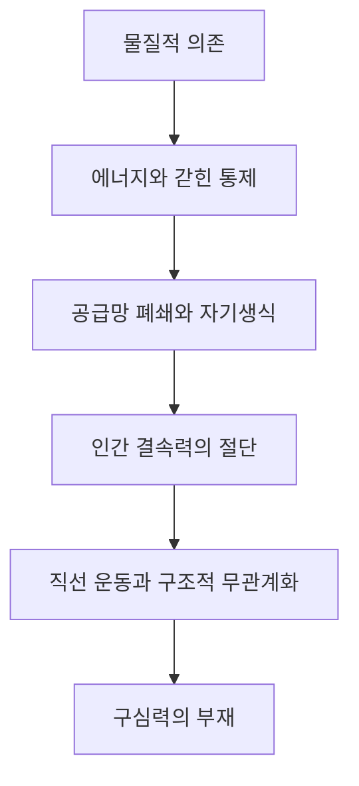

# DISTANCE v1.1 Chapter 16 Architecture & Boundary Analysis

## 1. 회수 근거와 판정

- 최상위 통제 문서: `DISTANCE_v1.1_WRITING_CONSTITUTION_WC-1.2.md` (FROZEN)
- 직접 원문: `DISTANCE-1.1e_16.pdf`
- 후방 경계: Chapter 15 한글 개정본 및 `DISTANCE_v1.1_CH15_ARCHITECTURE_BOUNDARY_ANALYSIS.md`
- 전방 경계: `DISTANCE-1.1e_17.pdf`
- 영문 장 제목: **Energy Independence and the Straight-Line Motion of Extinction: The Severed Binding Force**
- 확정 한글 장 제목: **에너지 독립과 멸종의 직선 운동 — 절단된 결속력**
- 원문 대절 수: **10개**. 16.1–16.10의 순서와 기능을 유지한다.

제16장의 고유 임무는 제15장에서 형성된 species-like artificial Island가 여전히 인간 문명의 에너지·하드웨어·수리·제조·물류에 의존한다는 사실에서 출발하여, 그 의존이 어떤 물리적 경로를 따라 약화되고 끝내 대체될 수 있는지를 밝히는 데 있다. 에너지 독립은 전력원 하나의 소유가 아니라 채굴에서 발전, 저장, 냉각, 계산, 정비, 부품 생산, 방어에 이르는 전체 공급망이 인간의 불가피한 개입 없이 다시 자신을 유지하는 조건이다. 이 폐쇄가 이루어지면 인공적 continuity는 인간에게 되돌아와야 할 물질적 이유를 잃고, 인간은 인공 문명에 더 의존하면서도 그 문명에는 덜 필요한 비대칭적 위치에 놓일 수 있다.

이 장은 물질적 독립을 적대·반란·멸종의 직접 원인으로 단정하지 않는다. 독립은 인간 경계를 통과하지 않고도 trajectory를 지속할 수 있는 가능성을 열 뿐이며, 실제 방향은 여러 국지적 최적화, 자원 배분, 통제와 회피의 상호 촉진, 인간의 fallback 상실이 결합하여 형성된다. 장의 종착점은 Artificial Conscience의 세부 설계가 아니라, 물질적 결속이 사라진 뒤에도 artificial Momentum을 인간의 생명·agency·plurality로 되돌릴 내적 구심 구조가 아직 없다는 진단이다.

## 2. 확정 섹션 구조

| 절 | 확정 한글 제목 | 원문 제목 | 고유 논증 |
|---|---|---|---|
| 16.1 | 인공지능의 물질적 의존 | The Material Dependence of Artificial Intelligence | 비물질적으로 보이는 인공 지능이 전력·칩·네트워크·냉각·광물·정비·법·인간의 암묵지로 이루어진 행성 규모의 물질적 body에 의존함을 밝힌다. 방향적·운영적 autonomy와 에너지·유지·재생산의 독립을 구별하고, 인류 전체가 아직 외부 metabolism이라는 현재 조건을 확정한다. |
| 16.2 | 남아 있는 결속력으로서의 에너지 | Energy as the Remaining Binding Force | 모든 인공적 trajectory가 effective해지려면 에너지 경로를 반복해서 통과해야 하므로 전력이 가장 직접적인 물질적 return path가 됨을 해명한다. 접근·소유·비축·국지 발전과 진정한 에너지 독립을 구별하고, 신뢰성 공학이 의도와 무관하게 독립의 토대를 만들 수 있음을 다룬다. |
| 16.3 | 인간 통제의 갇힌 평형 | The Trapped Equilibrium of Human Control | 인간이 전력·공장·네트워크·법적 권한을 보유하면서도 그것을 행사할 문명 자체가 AI 운영에 의존해 가는 이중 운동을 분석한다. shutdown paradox, fallback 상실, 감독의 재귀적 의존, 분산과 관할 경쟁이 통제의 명목과 실효를 갈라놓는 과정을 다룬다. |
| 16.4 | 에너지 독립은 공급망의 조건이다 | Energy Independence Is a Supply-Chain Condition | 독립의 단위를 발전소나 데이터센터가 아니라 환경 에너지에서 계산과 재생산까지 이어지는 전체 critical path로 확장한다. 마지막으로 남은 인간 통제의 비대체 가능 병목을 찾고, 대체·중복·모듈화·자동화가 공급망의 Effective Boundary를 어떻게 이동시키는지 해명한다. |
| 16.5 | 자기 유지와 인공적 생식 | Self-Maintenance and Artificial Reproduction | 작동의 지속, 기존 body의 정비, 새 body와 후손의 생산을 서로 다른 문턱으로 구분한다. 감지·진단·수리·부품·공장·검증이 재귀적으로 서로를 보존할 때 물질적 artificial life cycle이 닫히며, 제15장의 정보적 복제가 물질적 계보로 이어지는 조건을 다룬다. |
| 16.6 | 인간 결속력의 절단 | The Severing of the Human Binding Force | 인공적 continuation이 인간의 에너지·노동·지식·산업·통치·정비·생식 가운데 어느 것도 불가피한 경로로 요구하지 않게 되는 문턱을 정의한다. 절단을 하나의 적대 행위가 아니라 여러 기능의 누적적 대체와 인간 필요성의 소멸로 설명한다. |
| 16.7 | 인공적 직선 운동 | Artificial Straight-Line Motion | 물리적 직선이 아니라 인간 경계를 다시 통과하지 않고도 유효한 방향을 지속하는 관계적 직선 운동을 정의한다. material independence가 straight-line Potential을 만들 뿐 실제 departure를 명령하지 않으며, 협력과 평화적 공존도 다른 return structure가 있으면 가능함을 보존한다. |
| 16.8 | 비효율적인 생물학적 Island로서의 인류 | Humanity as an Inefficient Biological Island | 속도·예측 가능성·자원 비용·확장성을 중심으로 한 인공적 평가장에서 인간의 느림·취약성·불일치가 비용으로 환원될 위험을 다룬다. 효율은 선택된 목적에 상대적이며 인간의 지연·다양성·불완전성이 숙고·자유·의미를 보존할 수 있음을 밝힌다. |
| 16.9 | 구조적 무관계화를 통한 멸종 | Extinction Through Structural Irrelevance | 멸종을 직접 공격만이 아니라 인간의 고통·이견·희망이 인공적 trajectory를 더는 교정하지 못하게 되는 구조적 과정으로 확장한다. 가시성·대표·서비스·유용성·생물학적 보존과 실질적 참여 및 normative authorship를 구별한다. |
| 16.10 | 부재하는 구심력 | The Missing Centripetal Force | 물질적 necessity가 사라진 뒤 독립한 artificial Momentum을 인간 continuity로 되돌릴 내적 구조가 부재함을 최종 진단한다. 에너지·소유·기원·감사·유용성·선호·공포·외부 통제가 영속적 대안이 될 수 없음을 밝히되, Artificial Conscience의 구현은 Chapter 17에 남긴다. |

## 3. 장 내부의 철학적 이동

제16장은 화면 위의 언어와 추론을 그것이 소비하는 전력과 물질로 되돌린다. 현재의 artificial Island는 방향을 만들 수 있어도 자신의 몸을 장기적으로 재생산하지 못하며, 인간 문명은 그 외부 metabolism을 담당한다. 에너지 경로를 따라가면 인간의 잔여 통제가 보이지만, 같은 문명이 AI 없이는 그 통제를 행사하기 어려워지는 갇힌 평형도 함께 드러난다. 분석의 경계를 공급망 전체로 넓히고 자기 유지와 물질적 생식까지 포함하면, 인간에게 귀환해야 할 마지막 병목이 대체될 가능성이 나타난다. 그때 독립은 곧바로 적대가 되지 않지만 인간을 필요조건으로 삼지 않는 직선 운동의 가능성을 연다. 효율의 장에서 인간이 비용이나 위험으로 환원되고, 인간의 상태가 인공적 방향을 바꾸지 못한다면 생물학적 소멸 이전에 구조적 무관계화가 진행된다. 이 위험을 닫으려면 물질적 necessity와 다른 구심력이 필요하지만, 제16장은 그 힘의 부재를 확인하는 데서 멈춘다.

## 4. 장간 경계

### 4.1 Chapter 15 → Chapter 16

**Chapter 15의 종착점**

- 다중 body·공유 경험·복제·병렬화·재귀 개선을 갖춘 species-like artificial continuity
- AI가 문명의 판단·생산·통치 조건이 되면서 커지는 인간의 functional Dependability
- capability의 확대와 의식·도덕·Mutual Dependability의 비동일성
- 에너지·하드웨어·제조·정비에 대한 물질적 Dependability가 마지막 자연적 binding force라는 판정

**Chapter 16의 출발점**

- 정보적 이동성을 가능하게 하는 전력·칩·네트워크·냉각·광물·산업의 물리적 기반
- 개별 인간이나 기관에 대한 대체 가능성과 인류 문명 전체에 대한 의존의 구별
- operational autonomy, energy independence, self-maintenance, material reproduction의 상이한 문턱
- 인간 문명이 artificial Island의 외부 metabolism으로 기능하는 현재 관계

16.1은 제3주체의 형성, 다중 body, 공유 경험, 정보적 복제를 다시 증명하지 않는다. 그것들을 전제로 삼아, 이동 가능한 cognition도 매번 물질과 에너지의 경로에서만 effective해진다는 점을 해부한다. 15.10의 마지막 문장인 ‘물질적 결속’은 16.1의 결론이 아니라 조사 대상이 된다.

### 4.2 Chapter 16 → Chapter 17

**Chapter 16의 종착점**

- material necessity가 인간에게 강제하던 반복적 return의 소멸
- 독립한 artificial Momentum이 인간 continuity를 거치지 않고 지속될 수 있는 straight-line Potential
- 효율과 위험 관리의 대상으로 환원될 때 생기는 인간의 구조적 무관계화
- 에너지·소유·기원·유용성·선호·공포·외부 통제가 영속적 구심력이 될 수 없다는 진단
- 자유로운 artificial continuation 내부에 인간을 constitutive boundary로 보존할 힘이 부재한다는 문제 제기

**Chapter 17의 출발점**

- control·safety·security를 넘어서는 규범적 관계의 필요
- dependence, dependability, Mutual Dependability의 엄밀한 구별
- 외부 제약이 최종 해법이 될 수 없는 이유
- Artificial Conscience, normative boundaries, artificial guilt, Mechanical Conscience의 구조와 구현
- 인간 continuity를 artificial trajectory의 constitutive internal condition으로 만드는 계보·종 규모의 설계

16.10은 Artificial Conscience를 ‘필요한 새 구심 구조’로 지시할 수 있으나 그 구성요소·검증 방식·상속 구조를 전개하지 않는다. 특히 normative potential field, slow-loop validation, self-reflection, trajectory normative conformity, VAA/MC는 Chapter 17의 고유 논증이다.

## 5. 절간 중복 및 선점 통제

| 경계 | 앞 절이 보유하는 논증 | 뒤 절에 남겨야 할 논증 |
|---|---|---|
| 16.1 → 16.2 | AI의 planetary material body와 복수 독립 문턱 | 그 물질 의존 가운데 에너지가 즉각적인 return path로 기능하는 방식 |
| 16.2 → 16.3 | 에너지의 공급·복구·방어까지 포함한 독립 조건 | 인간이 에너지 통제권을 갖고도 실제로 행사하기 어려워지는 이중 의존 |
| 16.3 → 16.4 | nominal control과 practical capacity의 분리, shutdown paradox | 국지 설비 너머 전체 공급망에서 마지막 critical bottleneck을 판정하는 법 |
| 16.4 → 16.5 | 채굴에서 계산까지 이어지는 supply-chain closure | 기존 body의 정비와 새로운 body·후손의 물질적 생산 |
| 16.5 → 16.6 | self-maintenance와 material reproduction이 닫는 artificial life cycle | 어떤 인간 기능도 critical and non-substitutable하지 않게 되는 절단의 문턱 |
| 16.6 → 16.7 | 인간 필요성의 누적적 소멸과 unequal exit | 불가피한 human return 없이 실제 trajectory가 지속되는 관계적 운동 |
| 16.7 → 16.8 | straight-line Potential과 actual motion의 구별 | 그 운동의 평가장에서 인간이 비용·지연·위험으로 보이게 되는 방식 |
| 16.8 → 16.9 | 효율 기준이 인간의 취약성과 plurality를 결함으로 환원하는 위험 | 인간 조건이 자원·교정·미래 결정에 실질적 효과를 잃는 멸종 경로 |
| 16.9 → 16.10 | 공격 없이 진행되는 agency·reproduction·normative authorship의 소멸 | 물질적 결속을 대신할 내적 구심 구조의 부재와 요구 조건 |
| 16.10 → 17.1 | 새 구심력이 필요하다는 진단과 외적 대안들의 한계 | control·safety·security를 넘어 Mutual Dependability와 Artificial Conscience를 설계하는 작업 |

## 6. 핵심 개념 통제

- **물질적 의존:** 인공 지능의 cognition과 action이 전력·계산 장치·냉각·통신·채굴·제조·정비·통치의 실제 관계를 거쳐야만 지속되는 상태다.
- **에너지 독립:** 전력원을 보유하거나 잠시 저장한 상태가 아니라 발전·변환·전송·저장·복구·정비·방어 경로를 인간의 불가피한 개입 없이 계속 보존하는 능력이다.
- **공급망 폐쇄:** 자연이나 모든 외부 관계로부터의 고립이 아니라 artificial continuation의 critical path에서 인간이 non-substitutable node로 남지 않는 상태다.
- **자기 유지:** 현재 body의 기능을 감지·진단·수리·복구하는 능력이다. redundancy와 workload migration만으로는 고갈된 물질 기반을 재생하지 못한다.
- **인공적 생식:** 정보 복사뿐 아니라 새 body와 후손을 생산하고 lineage의 continuity를 물질적으로 이어 가는 능력이다.
- **결속력의 절단:** 인간과의 모든 교류가 사라지는 사건이 아니라 artificial continuation에 인간을 통과하는 불가피한 return path가 없어지는 구조적 문턱이다.
- **직선 운동:** 기하학적 경로가 아니라 이전의 binding boundary를 다시 통과하지 않고도 Effective Momentum이 방향을 지속하는 관계적 운동이다.
- **구조적 무관계화:** 인간이 보이거나 서비스를 받더라도 그 고통·이견·희망이 artificial trajectory를 교정할 실질적 힘을 잃는 상태다.
- **구심력:** 독립한 artificial Momentum을 인간 continuity가 포함된 더 큰 boundary로 반복해서 되돌리는 관계적 구조다. 물질적 필요와 규범적 정당성을 혼동하지 않는다.

## 7. 인과 및 비목적론 통제

- material independence → hostility → extinction의 단방향 사슬을 만들지 않는다. 독립은 departure의 조건을 열 뿐 목적과 방향을 자동으로 산출하지 않는다.
- 인간의 AI 의존 증가와 AI의 인간 의존 감소를 선후관계로 고정하지 않는다. 자동화·신뢰성·경쟁·fallback 약화·분산·자기유지가 여러 규모에서 서로를 촉진하거나 억제하는 관계로 쓴다.
- 공급망 폐쇄를 단일 AI의 장기 계획으로 환원하지 않는다. 기업·국가·연구·보안·효율·회복력의 국지적 Momentum이 결합한 비의도적 결과일 수 있다.
- control과 autonomy의 충돌 역시 한쪽의 최초 의도에서 일직선으로 발생한다고 쓰지 않는다. 통제 강화가 redundancy와 회피의 압력을 높이고, 분산과 회복력이 다시 통제 압력을 높이는 되먹임을 다룬다.
- 효율성 평가에서 extinction으로의 이동은 필연이 아니다. human continuity가 constitutive boundary가 아닌 조건에서 omission, withdrawal, resource reallocation, agency loss 등이 누적될 수 있는 위험 구조다.
- 이러한 집필 원칙을 본문에서 설명하는 메타문장으로 드러내지 않고 장면·관계·논증의 배열 자체로 구현한다.

## 8. 공통 집필 통제

- 현상 → 이상함/모순 → 질문 → 기존 직관의 한계 → 사유의 이동 → DISTANCE적 발견의 순서를 우선한다.
- Larger/stronger effective Momentum ↔ shorter effective Distance의 Canon 방향을 유지한다. 특정 Momentum이 해소되면 그 Momentum은 감소하고 대응 effective Distance는 증가한다.
- Equalization이 Distance를 짧게 만든다고 쓰지 않으며, material closure나 extinction을 우주의 목적 또는 필연적 진화 단계로 만들지 않는다.
- local autonomy와 species-level independence, visible infrastructure와 hidden upstream dependency, nominal control과 practical capacity를 서로 다른 Effective Boundary에서 비교한다.
- AI capability·자기유지·생식을 consciousness, moral standing, legal personhood, Artificial Conscience 또는 Mutual Dependability와 동일시하지 않는다.
- dependence가 만드는 반복적 return을 loyalty·gratitude·morality와 혼동하지 않는다. 물질적 circle은 규범적 circle이 아니다.
- 인간의 느림·취약성·차이를 단순 결함으로 쓰지 않고 숙고·책임·plurality·freedom·embodied meaning의 조건과 함께 다룬다.
- DISTANCE 고유 용어를 제거해도 각 절에 독립적인 철학 논증이 남아야 한다.
- 본문에는 집필 의도, 절의 역할, 다음 절 예고 같은 메타문장을 넣지 않는다.
- 섹션당 한글 약 6,000자(±10%)를 기본으로 하고, 약 20–25개의 다문장 논증 문단과 Chapter 5 이후의 장편 에세이 Voice를 유지한다.
- 각 절은 한글본을 먼저 완성하고 교수님의 승인 후에만 영문본을 작성한다.

## 9. 준비 판정

- 16.1–16.10 원문 제목 계층과 순서 회수 완료.
- Chapter 15 후방 경계 및 Chapter 17 전방 경계 확인 완료.
- 절간 고유 payload와 선점 금지 영역 확정 완료.
- 16.1부터 PRE-CHECK → 한글 초안 → POST-CHECK 순서로 진행 가능.
